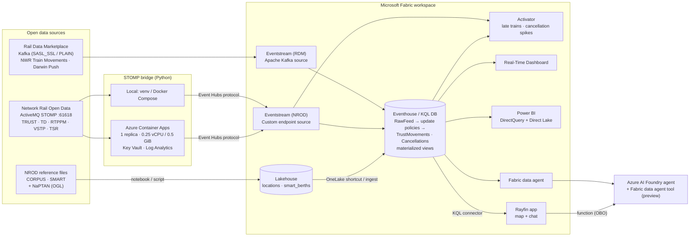

# Real-Time Rail Intelligence on Microsoft Fabric

A hands-on, staged lab series that streams **live Great Britain rail data** into **Microsoft Fabric Real-Time
Intelligence**, turns it into dashboards and alerts, and lets people **chat with the network** through a
Fabric data agent, an Azure AI Foundry agent and a Rayfin (Fabric Apps) web app.

You can use it in two ways:

* **Deploy as-is.** Run the scripts in each lab (Option A) to get a working end-to-end solution quickly.
* **Learn step by step.** Follow the manual portal instructions (Option B) in each lab as a training course.

> **Not an official service.** The repo uses open data from Network Rail and the Rail Data Marketplace.
> Credit the data source. Don't call your app "official" and don't use Network Rail or National Rail logos.
> See [Licensing and attribution](#licensing-and-attribution).

---

## Architecture



| Layer | Choice | Why |
|---|---|---|
| Kafka ingestion | Eventstream **Apache Kafka** source | Rail Data Marketplace exposes Kafka with SASL_SSL/PLAIN. No code needed |
| STOMP ingestion | Python bridge → Eventstream **custom endpoint** (Event Hubs protocol) | Eventstream has no STOMP source |
| Bridge hosting | **Azure Container Apps**, exactly 1 replica | A long-lived connection that must be single-instance per durable client-id. Costs about $14/month at list price |
| Storage and query | **Eventhouse** (KQL) and **Lakehouse** | Update policies parse batched TRUST JSON. Materialized views hold the current state |
| Insight | Real-Time Dashboard, Power BI, Activator | Live tiles, history and alerts |
| AI | Fabric data agent → Foundry agent → Rayfin app | Ask questions in natural language, with the user's own identity |

## Lab index

| Lab | Title | Time | Automated? |
|---|---|---|---|
| [00](docs/labs/00-overview.md) | Overview, architecture, costs, licensing, preview caveats | 20 min | – |
| [01](docs/labs/01-prerequisites.md) | Prerequisites and accounts (NROD, RDM, Azure, Fabric, tenant settings, tools) | 45 min (+ approval wait) | Manual |
| [02](docs/labs/02-fabric-workspace.md) | Fabric workspace, Eventhouse, KQL database, Lakehouse, Eventstreams | 20 min | ✅ `fabric-setup.sh/.ps1` |
| [03](docs/labs/03-reference-data.md) | Reference data (CORPUS, SMART, NaPTAN) → Lakehouse and KQL | 30 min | ✅ `load_reference_data.py` / notebook |
| [04](docs/labs/04-rdm-kafka-eventstream.md) | Ingest RDM Kafka Train Movements with Eventstream | 30 min | Manual (portal) |
| [05a](docs/labs/05a-bridge-local.md) | STOMP bridge running locally (venv and Docker): console → file → Eventstream | 40 min | ✅ `run-local.sh/.ps1` |
| [05b](docs/labs/05b-bridge-azure-container-apps.md) | STOMP bridge on Azure Container Apps (Bicep) | 30 min | ✅ `deploy-bridge.sh/.ps1` |
| [06](docs/labs/06-kql-transformations.md) | KQL tables, update policies, materialized views, functions | 40 min | ✅ `apply_kql.py` |
| [07](docs/labs/07-activator-alerts.md) | Activator alerts (late trains, cancellation spikes, stalled feed) | 30 min | Manual (portal) |
| [08](docs/labs/08-dashboard-powerbi.md) | Real-Time Dashboard and Power BI report | 45 min | Manual (queries supplied) |
| [09](docs/labs/09-fabric-data-agent.md) | Fabric data agent (instructions and example queries) | 30 min | Manual (content supplied) |
| [10](docs/labs/10-foundry-agent.md) | Foundry agent with the Fabric data agent tool and a Python client | 30 min | ✅ `foundry/agent_client.py` (after portal connection) |
| [11](docs/labs/11-rayfin-app.md) | Rayfin app: live map and "chat with the network" | 60 min | CLI + overlay code |
| [12](docs/labs/12-cleanup.md) | Clean-up | 10 min | ✅ `cleanup.sh/.ps1` |

## Quick start: deploy as-is

You need the accounts and tenant settings from [Lab 01](docs/labs/01-prerequisites.md). You also need the Azure CLI (`az login`), Python 3.11+ and, if you want it, Docker.

```bash
git clone https://github.com/<you>/rail-fabric-rti.git && cd rail-fabric-rti
cp .env.example .env            # fill in NROD_*, AZ_*, FABRIC_CAPACITY_ID ...

# 0. Try the bridge offline. No accounts needed: it replays the bundled sample messages
./scripts/run-local.sh venv console --replay

# 1. Fabric items (Lab 02). Copy the IDs it prints into .env
./scripts/fabric-setup.sh

# 2. KQL schema, update policies and views (Lab 06; run before you send any data)
python -m pip install -r fabric/scripts/requirements.txt
python fabric/scripts/apply_kql.py

# 3. Reference data (Lab 03)
python fabric/scripts/load_reference_data.py --to-kql --to-onelake

# 4. Portal step: add the custom endpoint source to RailEventstreamNrod and the
#    Eventhouse destination (RawFeed table, RawFeedMapping). Copy the Event Hub connection
#    string into EVENTSTREAM_CONNECTION_STRING (Lab 05a, section "Wire to Eventstream")

# 5. Bridge on Azure Container Apps (Lab 05b)
./scripts/deploy-bridge.sh
```

On Windows, use the matching `.ps1` scripts, for example `./scripts/fabric-setup.ps1` and `./scripts/deploy-bridge.ps1`.

Then follow Labs 04 and 07–11 for the portal-only parts: the RDM Kafka source, Activator, dashboards, the data agent, Foundry and Rayfin.

### What is automated and what is manual

| Automated (scripts in this repo) | Manual only (step-by-step in the labs) |
|---|---|
| Workspace, Eventhouse, KQL database, Lakehouse and empty Eventstream items (Fabric REST API) | Eventstream **sources/destinations** (Kafka source, custom endpoint, Eventhouse destination) |
| All KQL tables, mappings, update policies, materialized views and functions | Activator rules |
| Reference data download, Lakehouse load and KQL load | Real-Time Dashboard tiles and the Power BI report |
| Bridge: local venv/Docker, Azure infrastructure (Bicep), image build, Key Vault secrets | Fabric data agent creation and publishing |
| Foundry agent creation and chat (after the Fabric connection exists) | Foundry Fabric tool connection (portal, or an ARM REST call) |
| CI: lint, tests, Docker build, GHCR push, Bicep lint | Rayfin scaffold and deploy (Rayfin CLI) |

The Eventstream topology, Activator rules, dashboards and data agent can be defined through Fabric item definitions in principle. This repo doesn't generate those payloads, because hand-written definitions are fragile and change often. Those labs give portal steps instead.

## Repository layout

```
├── README.md · LICENSE · CONTRIBUTING.md · .env.example · .gitignore
├── docs/labs/                 00–12 lab guides
├── src/bridge/                Python STOMP → Eventstream bridge (+ Dockerfile, compose, tests)
├── infra/                     Bicep: Container Apps env + app, Log Analytics, Key Vault, ACR, managed identity
├── scripts/                   run-local / deploy-bridge / fabric-setup / cleanup (.sh and .ps1)
├── fabric/
│   ├── kql/                   01–04 schema scripts, 05 shortcut load, 06 sample queries, 07 TOC seed
│   ├── notebooks/             Reference-data notebook (.ipynb)
│   ├── scripts/               apply_kql.py, load_reference_data.py
│   ├── data-agent/            Instructions + example question/KQL pairs
│   ├── dashboard/             Real-Time Dashboard tile queries
│   └── activator/             Activator rule specifications
├── foundry/                   Foundry agent client (Python) + setup notes
├── app/                       Rayfin app starter (overlay files + guide)
└── .github/workflows/         bridge-ci, infra-validate
```

## Costs (indicative, check current pricing)

| Item | Indicative cost | Notes |
|---|---|---|
| Azure Container Apps bridge (0.25 vCPU / 0.5 GiB, always on) | **~$14/month** list-price estimate after the monthly free grant | Size up to 0.5 vCPU / 1 GiB for `TD_ALL_SIG_AREA` (~6,000 msgs/min) |
| Log Analytics | Pay per GB ingested | The bridge logs a small amount at INFO. Retention is 30 days by default |
| Key Vault, ACR Basic | Small | Use GHCR (`CONTAINER_IMAGE=ghcr.io/...`) to skip ACR |
| Fabric capacity | F2 or higher (trial works for most labs) | Pause pay-as-you-go capacity when you're not using it. The Foundry Fabric tool needs **paid F2+** |
| Azure AI Foundry | Model tokens | The Fabric tool adds a data agent query for each question |
| *Alternative rejected:* Azure Functions Premium/Flex always-ready | ~$80–150+/month | Functions only suit the daily reference-file pull |

Use the [Azure pricing calculator](https://azure.microsoft.com/pricing/calculator/) and the [Fabric pricing page](https://azure.microsoft.com/pricing/details/microsoft-fabric/) for your region.

## Preview and experimental features

* Fabric data agent tool in Azure AI Foundry: **preview**. User identity (OBO) only, no service principals, and one data agent for each Foundry agent in this design.
* Fabric Apps / Rayfin: **preview**. Rayfin connectors are preview (`kusto` is *private preview*). Rayfin functions are **experimental**.
* RDM "NWR Train Movements" is a **beta** product with no SLA.
* Lakehouse "Load Table" REST API: **preview**.

## Licensing and attribution

* Code: [MIT](LICENSE).
* Data: Network Rail open data (Network Rail Infrastructure Limited, Open Government Licence). Rail Data Marketplace products are under the licence shown on each product page. NaPTAN is © Crown copyright (OGL v3.0). You must **attribute** the source wherever you show the data. Don't describe anything as "official", and don't use Network Rail or National Rail logos.
* NROD accounts are capped (about 1,000 users). Use **one** connection for each account, and don't run the local and cloud bridges together with the same client-id.

## Contributing

See [CONTRIBUTING.md](CONTRIBUTING.md).
