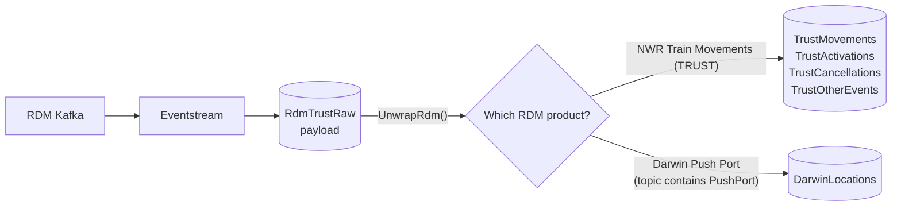

# Lab 04 – Ingest RDM Kafka Train Movements with Eventstream

**Time:** 30 minutes · **Previous:** [Lab 03](03-reference-data.md) · **Next:** [Lab 05a](05a-bridge-local.md)

## Objectives

* Connect the **Apache Kafka** source connector in Eventstream to the Rail Data Marketplace *NWR Train Movements* product.
* Land the raw messages in the Eventhouse table **`RdmTrustRaw`** (one dynamic `payload` column), where update policies (Lab 06) parse them.

> **Shared Event Hub mode (optional, [Lab 05c](05c-shared-event-hub.md)).** If your instructor runs the shared Event Hub,
> **don't** add the Apache Kafka source below and you don't need your own RDM account. Instead, add an **Azure Event Hubs** source
> for the `rdm-trust` hub with your own consumer group (Lab 05c, step S2). The destination (`RdmTrustRaw`, `RdmTrustRawMapping`)
> and the checkpoint queries are the same.

## Prerequisites

* Lab 02 (Eventstream `RailEventstreamRdm`) is done.
* The table **`RdmTrustRaw`** and mapping **`RdmTrustRawMapping`** exist ([Lab 02, "Create the raw tables and mappings now"](02-fabric-workspace.md#create-the-raw-tables-and-mappings-now)).
  Check before you start. In a KQL queryset on `RailKQL`, run:

  ```kusto
  .show table RdmTrustRaw ingestion json mappings
  ```

  If it says the table doesn't exist, run `01_tables.kql` and `02_update_policies.kql` first (see Lab 02). **Don't** let the
  Eventstream wizard create the table: it builds its own columns, and the parsing in Lab 06 expects one `payload` column.
* The table **`RdmTrustRaw`** and mapping **`RdmTrustRawMapping`** exist ([Lab 02, "Create the raw tables and mappings now"](02-fabric-workspace.md#create-the-raw-tables-and-mappings-now)).
  Check before you start. In a KQL queryset on `RailKQL`, run:

  ```kusto
  .show table RdmTrustRaw ingestion json mappings
  ```

  If it says the table doesn't exist, run `01_tables.kql` and `02_update_policies.kql` first (see Lab 02). **Don't** let the
  Eventstream wizard create the table: it builds its own columns, and the parsing in Lab 06 expects one `payload` column.
* The Kafka details from your RDM subscription page.

## Option A – automated

Not available. The Eventstream topology (sources, destinations, operators) is configured in the portal. This repo
doesn't generate Eventstream definition payloads. Follow Option B.

## Option B – manual (portal)

> Portal labels change from time to time. If a label differs slightly, pick the closest match.

1. Open **RailEventstreamRdm** → **Add source** → **Connect data sources** → **Apache Kafka** → **Connect**.
2. Create a **new connection**:
   * **Bootstrap server**: from RDM (`host:port`; comma-separate multiple brokers)
   * **Connection name**: for example `rdm-kafka`
   * **Authentication kind**: **API Key**. This is the only option offered, and it's how Fabric stores SASL
     username/password credentials:
     * **Key** = your RDM Kafka **consumer username**
     * **Secret** = your RDM Kafka **consumer password**
   * Select **Connect**.

   > There's no separate "username/password" option in the Eventstream Kafka connection. The **Key** and **Secret**
   > are sent as the SASL username and password once you choose `SASL_SSL` / `PLAIN` in the next step.
3. Configure the source:
   * **Topic**: from RDM
   * **Consumer group**: from RDM. Use the exact value RDM issued
   * **Reset auto offset**: `Latest` for live demos, `Earliest` to backfill whatever the broker retains
   * **Security protocol**: `SASL_SSL`
   * **SASL mechanism**: `PLAIN` (not SCRAM)
   * Leave **TLS/mTLS settings** off. RDM's brokers use a publicly trusted certificate.
4. **Next** → **Add** → **Publish**. In **Data preview**, you should see JSON TRUST messages appear (if preview stays empty, see Troubleshooting – check the Eventhouse table instead).
5. **Add destination** → **Eventhouse**:
   * **Data ingestion mode**: **Direct ingestion**. Use this mode – it's the one that lets you pick an existing table and
     an existing mapping. (*Event processing before ingestion* derives its own columns from the JSON and doesn't offer
     existing mappings.)
   * **Destination name** (for example `to-RdmTrustRaw`), **Workspace** `rail-fabric-rti`, **Eventhouse** `RailEventhouse`,
     **KQL Database** `RailKQL` → **Save**.
   * Make sure the destination card is connected to the stream, then **Publish**.
6. Switch to **Live view**. On the Eventhouse destination node, select **Configure**. The Eventhouse **Get data** wizard opens:
   1. **Destination table**: choose the **existing** table **`RdmTrustRaw`**. *Don't* choose **New table** – if `RdmTrustRaw`
      isn't listed, the table hasn't been created yet (see Prerequisites and Troubleshooting).
   2. Keep the suggested **data connection name** → **Next**. Pulling sample events can take a few minutes.
   3. Select **RDMTrustRaw_mapping** dropdown and choose the option to use an **existing mapping**, then pick **`RdmTrustRawMapping`**. The preview
      should show a single column, `payload`, containing the whole message.
   4. **Finish** → **Close**.

   > The exact wording of the mapping option can vary between Fabric releases. If you can't find it, use **Edit columns**
   > so the table keeps **only** the `payload` column (type `dynamic`) mapped from the **whole record**, and remove any other
   > columns the wizard proposes. The Lab 06 update policies only read `payload`.

## How data moves from `RdmTrustRaw` to the parsed tables

There's no extra Eventstream step. The **update policies** you created with `02_update_policies.kql` (Lab 02) run
inside the Eventhouse every time a batch lands in `RdmTrustRaw`:



1. **`UnwrapRdm()`** removes the RDM envelope. RDM delivers each message as a serialised ActiveMQ message
   (`destination`, `messageID`, `properties`, …) with the real feed JSON as a **string** in `bytes` (or `text`).
2. **TRUST** messages (NWR Train Movements) are expanded by `msg_type` into the `Trust*` tables, the same as the NROD bridge data.
3. **Darwin Push Port** messages (destination name contains `PushPort`, body has `uR`/`sR`) are parsed into **`DarwinLocations`**:
   one row per service (`rid`) and location (`tiploc`), with public times (`pta`/`ptd`), actual/estimated times, platform and a
   computed `arr_delay_minutes` / `dep_delay_minutes`.

**Which product are you receiving?** The RDM product you subscribe to decides which tables fill:

```kusto
RdmTrustRaw
| summarize messages = count(), last = max(ingestion_time()) by destination = tostring(payload.destination.name)
```

* `...PushPort-v18` (or similar) → **Darwin**. `DarwinLocations` fills; `TrustMovements` stays empty.
* Anything else carrying TRUST `header.msg_type` records → **NWR Train Movements**. The `Trust*` tables fill.

Labs 06–11 (views, dashboards, data agent, Rayfin map) are built on **`TrustMovements`**. To get it, either subscribe to
**NWR Train Movements** on RDM and add it as a second Apache Kafka source (its own topic and consumer group, same
`RdmTrustRaw` destination), or run the NROD bridge (Lab 05a/05b). Darwin is still worth keeping: it adds forecasts and platforms.
`DarwinLatest()` (in `04_query_functions.kql`) gives the latest Darwin state per service and location with station names and coordinates.

**Update policies only process data ingested after they exist.** If messages reached `RdmTrustRaw` before you ran
`02_update_policies.kql` (or before you re-ran it with this version), back-fill them **once**:

```bash
python fabric/scripts/apply_kql.py --file fabric/kql/02_update_policies.kql   # make sure the latest functions/policies are in place
python fabric/scripts/apply_kql.py --file fabric/kql/01_tables.kql           # adds DarwinLocations if missing (safe to re-run)
python fabric/scripts/apply_kql.py --file fabric/kql/08_backfill.kql         # run once only
```

(Or paste each whole file into a KQL queryset and run it. Run `01_tables.kql` before `02_update_policies.kql`.)

### Should Eventstream split arrays?

No. The update policies handle a single message object or a JSON array (batch), using `mv-expand`. You don't need an Eventstream operator.

## Checkpoint

```kusto
RdmTrustRaw | take 5
RdmTrustRaw | summarize n = count() by t = bin(ingestion_time(), 1m) | order by t desc
TrustMovements | where source == "rdm" | take 10          // NWR Train Movements
DarwinLocations | take 10                                  // Darwin Push Port
DarwinLocations | summarize n = count(), avg_arr_delay = avg(arr_delay_minutes) by bin(received_utc, 5m) | order by received_utc desc
.show table DarwinLocations policy update                  // should list ParseDarwinLocations()
```

## Troubleshooting

| Symptom | Fix |
|---|---|
| Source shows authentication errors | Check the connection's **Key** is the RDM consumer username and **Secret** is the RDM consumer password (no spaces). Check the mechanism is `PLAIN` and the protocol is `SASL_SSL`. To change them, edit the connection under **Settings → Manage connections and gateways** |
| Can't find a username/password option | Expected. Use **Authentication kind = API Key**: Key = username, Secret = password |
| Source runs but **Data preview** is empty or errors | Eventstream previews with a consumer group prefixed `preview-`, and the credentials need read access to it. RDM only grants your issued consumer group, so preview may fail even though ingestion works. Check the Eventhouse table (Checkpoint) instead |
| No data, no errors | Check the topic name and consumer group. Use `Latest` and wait a minute; it's a beta feed with no SLA |
| Data in `RdmTrustRaw` but none in `TrustMovements` | Check which product you're receiving (query above). Darwin (`PushPort`) goes to `DarwinLocations`, not `TrustMovements`. For TRUST, subscribe to **NWR Train Movements** |
| `DarwinLocations` (or `TrustMovements`) empty although new data arrives | Re-run `01_tables.kql` then `02_update_policies.kql` (this version adds `UnwrapRdm()`), check `.show table DarwinLocations policy update`, and look at `.show ingestion failures` |
| Older rows never parsed | Expected: update policies only see new data. Run `08_backfill.kql` once |
| No existing `RdmTrustRaw` in the table list, or no "existing mapping" option | The table and mapping weren't created first. Run `01_tables.kql` and `02_update_policies.kql` (Lab 02), then re-open **Configure** on the destination |
| You already let the wizard create a **new** `RdmTrustRaw` table | Its columns won't match. Delete the Eventhouse destination in the Eventstream, run `.drop table RdmTrustRaw ifexists` in `RailKQL`, run `01_tables.kql` and `02_update_policies.kql`, then redo steps 5–6 |
| Only *Event processing before ingestion* settings shown (table + JSON, no mapping choice) | You picked that mode. Delete the destination and add it again with **Direct ingestion** |
| Duplicated movements | You're also ingesting `TRAIN_MVT_ALL_TOC` through the bridge. Filter on `source`, or drop one feed (see Lab 00) |
| Only part of the data arrives | Another consumer uses the same RDM consumer group, for example the instructor's RDM relay (Lab 05c) or a second Eventstream | Run only one reader per RDM consumer group |
