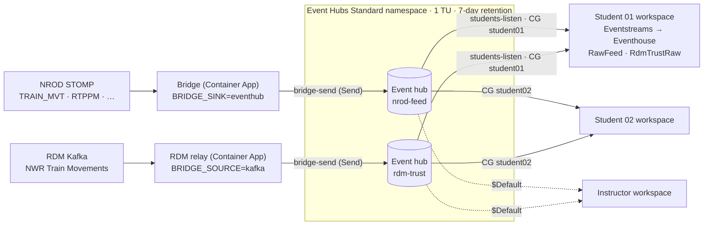

# Lab 05c – Optional: shared Azure Event Hub for classes and paused capacities

**Time:** 45 minutes (instructor 30, each student 15) · **Previous:** [Lab 05b](05b-bridge-azure-container-apps.md) · **Next:** [Lab 06](06-kql-transformations.md)

> **This lab is optional.** The direct paths stay the default and keep working: RDM Kafka → Eventstream Apache Kafka
> source (Lab 04) and bridge → Eventstream custom endpoint (Labs 05a/05b). Skip this lab if you work alone and your
> Fabric capacity runs whenever the bridge does.

## Objectives

* Put an **Azure Event Hubs (Standard)** namespace between the rail data sources and Fabric.
* Run **one** instructor-owned ingestion (the NROD bridge, plus an optional RDM Kafka relay) that feeds **many** students,
  each with their own Fabric workspace, Eventstream and Eventhouse.
* Keep data flowing while a Fabric capacity is **paused overnight**, and let each Eventstream catch up when it resumes.

## When to use it

| Situation | Direct paths (default) | Shared Event Hub (this lab) |
|---|---|---|
| One person, capacity always on | ✅ Simplest | Not needed |
| A class of students, each building their own pipeline | ❌ NROD allows **one connection per account**, and RDM subscriptions are **per user**, so each student needs their own accounts | ✅ One NROD connection and one RDM subscription (the instructor's) feed everyone |
| Capacity paused overnight or at weekends | ❌ Bridge sends fail while the capacity is paused (see below) | ✅ Event Hubs keeps buffering for up to **7 days** |
| More than 19 students | – | Needs a second namespace or Premium (see [Limits](#limits-that-shape-the-design)) |

### What happens to data while the capacity is paused?

* **Direct path (custom endpoint).** The bridge only ACKs a STOMP frame after the sink accepts it. While the capacity is
  paused, sends to the Eventstream custom endpoint are expected to fail (*validate this in your tenant – the exact error
  isn't documented*). Each failure raises `SinkError`: the bridge does **not** ACK the frame, increments `send_failures`,
  disconnects and reconnects with exponential backoff (1, 2, 4 … capped at `BACKOFF_MAX_S`, default 60 s), then tries
  again with the redelivered frame. That loop is safe for short outages, but NROD only buffers a durable subscription for
  about **5 minutes**, so anything older than that is lost when the pause lasts longer. The Eventstream **Custom endpoint
  source doesn't support pause and resume** either ([Pause and resume data streams](https://learn.microsoft.com/en-us/fabric/real-time-intelligence/event-streams/pause-resume-data-streams)).
* **Shared Event Hub path.** The bridge and the RDM relay send to Azure Event Hubs, which doesn't depend on the Fabric
  capacity, so they keep running and ACK/commit normally. Event Hubs retains the events (7 days here). The Eventstream
  **Azure Event Hubs source supports pause/resume** with the resume options **When streaming was last stopped**, **Now**
  and **Custom time** (same page), so a student's Eventstream can pick up where it stopped.

> **Be honest with yourself about the overnight behaviour.** Microsoft documents pause/resume of an *Eventstream source*.
> What a source does after a full *capacity* pause and resume should be **validated in this lab** with the
> [overnight pause checkpoint](#overnight-pause-checkpoint). If the gap isn't back-filled automatically, use the documented
> fallback: **Deactivate** the source and **Activate** it with **Custom time** set to just before the pause.

## Architecture



| Piece | Setting | Why |
|---|---|---|
| Namespace tier | **Standard**, 1 throughput unit (TU) | Basic allows only **1 consumer group** per event hub and **1-day** retention. Standard allows **20 consumer groups** per event hub and up to **7 days** retention, and has a Kafka endpoint |
| Throughput | 1 TU = 1 MB/s (or 1,000 events/s) in, 2 MB/s (or 4,096 events/s) out | Plenty for TRUST and RTPPM. Egress is shared by every reader (see [Costs](#costs-estimates)) |
| Event hubs | `nrod-feed` (bridge envelope JSON → `RawFeed`), `rdm-trust` (raw RDM JSON → `RdmTrustRaw`) | Same tables and mappings as the direct paths |
| Partitions | 2 per hub | Can't be changed later on Standard. Two is enough for these volumes |
| Retention | 7 days (`messageRetentionInDays: 7`) | Standard maximum. Covers nights and weekends |
| Send rule | `bridge-send` (**Send**) on each hub | Stored in Key Vault as `eventhub-nrod-connection-string` / `eventhub-rdm-connection-string` |
| Listen rule | `students-listen` (**Listen**) on the namespace | One key works for both hubs. SAS rules can't be limited to a consumer group, so rotate it after the course |
| Consumer groups | `student01` … on **both** hubs; `$Default` reserved for the instructor | One consumer group per student Eventstream |

### Limits that shape the design

From [Event Hubs quotas and limits](https://learn.microsoft.com/en-us/azure/event-hubs/event-hubs-quotas):

| Limit | Basic | Standard | Premium |
|---|---|---|---|
| Consumer groups per event hub | 1 | **20** | 100 |
| Maximum retention | 1 day | **7 days** | 90 days |
| Non-epoch receivers per consumer group | 5 | 5 | 5 |
| Authorisation rules per namespace | 12 | 12 | 12 |

So: **one consumer group per student Eventstream** (never share one; see [Troubleshooting](#troubleshooting)), and at most
**19 students** per namespace on Standard (`$Default` is the instructor's). For more students, create a second namespace
(re-run the script with a different `EVENTHUB_NAMESPACE` and split the class) or use Premium.

## Costs (estimates)

List prices in USD from the [Event Hubs pricing page](https://azure.microsoft.com/pricing/details/event-hubs/) at the time of
writing. They're **estimates**: check the [Azure pricing calculator](https://azure.microsoft.com/pricing/calculator/) for your region and currency.

| Item | Estimate | Notes |
|---|---|---|
| Event Hubs **Standard**, 1 TU | $0.03/hour ≈ **$22/month** | Charged whether or not anyone reads |
| Ingress events | $0.028 per million | TRUST at ~600 batches/min ≈ 26 million events/month ≈ **$0.73**. The bridge splits batches into one event per message by default (`BRIDGE_SPLIT_BATCHES=true`), which makes it roughly **$3–4/month**. Billing counts each 64 KB of a send as one event |
| RDM relay container app (0.25 vCPU / 0.5 GiB, always on) | **~$14/month** | Only with `DEPLOY_RDM_RELAY=true`. Same estimate as the bridge in Lab 05b |
| *Not suitable:* Basic | $0.015/hour per TU | Only 1 consumer group and 1-day retention |

**Egress is shared.** Every student reads every event, so 19 students reading a 12-hour overnight backlog at the same time
share 2 MB/s (4,096 events/s) of egress per TU. As a rough estimate, catching up can take tens of minutes to about an hour
in the morning. Raise to 2 TUs for the catch-up window if that's too slow (`EVENTHUB_THROUGHPUT_UNITS=2` and re-run the script).

### The alternative: one shared instructor Eventhouse

Instead of N Eventhouses, the instructor runs the direct pipeline once and students **query** the instructor's Eventhouse
(workspace *Viewer* access or KQL database permissions, or a database shortcut in their own Eventhouse).

* ✅ Simpler and cheaper: no namespace and no student Eventstreams.
* ❌ Students don't build their own ingestion pipeline (Labs 04–06 become read-only).
* ❌ The shared Eventhouse runs on the instructor's capacity, so it still pauses with that capacity, and the direct
  custom endpoint path still loses data during long pauses.

**Recommendation:** use the shared Event Hub when students each build their own pipeline, or when the capacity is paused nightly.
Use a shared Eventhouse for short demos where students only need to query.

## Prerequisites

**Instructor**

* Labs 01 and 05b done (the shared Key Vault, the Container Apps environment and the bridge exist), with `AZ_RESOURCE_GROUP`,
  `AZ_LOCATION` and `NAME_PREFIX` unchanged.
* For the RDM relay: your RDM *NWR Train Movements* subscription details in `.env` (`RDM_KAFKA_*`, see Lab 04).
  **Stop the Eventstream Apache Kafka source** in your own workspace if it uses the same RDM consumer group, or the two
  consumers will split the partitions between them.

**Each student**

* Their own workspace with an Eventhouse, KQL database and the two Eventstreams (Lab 02), and the Lab 06 tables and
  mappings (`python fabric/scripts/apply_kql.py`).
* From the instructor: the **namespace name**, the **key name** `students-listen`, the **key**, and **their own consumer group** (for example `student07`).
* Students **don't** need their own NROD or RDM accounts in this mode.

## Option A – automated (instructor)

1. Set the optional variables in `.env` (see `.env.example`):

   ```bash
   STUDENT_CONSUMER_GROUP_PREFIX=student
   STUDENT_CONSUMER_GROUP_COUNT=15        # student01 … student15 (max 19)
   EVENTHUB_THROUGHPUT_UNITS=1
   EVENTHUB_RETENTION_DAYS=7
   ```

2. Create the namespace, hubs, rules, Key Vault secrets and consumer groups:

   ```bash
   ./scripts/create-eventhub.sh --what-if     # optional preview
   ./scripts/create-eventhub.sh               # or: ./scripts/create-eventhub.ps1  (-HideKey to not print the Listen key)
   ```

   What it does:
   1. Deploys `infra/keyvault.bicep` again (deployment `shared-keyvault`), which re-uses the Lab 01 vault and makes sure you can write secrets.
   2. Deploys `infra/eventhubs.bicep` (deployment `shared-eventhubs`): Standard namespace, `nrod-feed` and `rdm-trust`
      (2 partitions, 7 days), `bridge-send` (Send) per hub and `students-listen` (Listen) on the namespace.
   3. Reads each `bridge-send` connection string with `az eventhubs eventhub authorization-rule keys list` and stores them as
      Key Vault secrets `eventhub-nrod-connection-string` and `eventhub-rdm-connection-string`.
   4. Creates `student01` … on both hubs with `add-student-consumer-groups`.
   5. Prints `EVENTHUB_NAMESPACE` for your `.env`, and the connection details for students (the Listen key comes from
      `az eventhubs namespace authorization-rule keys list`). **Share the key privately**, never in a repo or a public chat.

3. Add more students later (idempotent; existing groups are skipped):

   ```bash
   ./scripts/add-student-consumer-groups.sh --prefix student --count 5 --start 16     # student16 … student20
   ./scripts/add-student-consumer-groups.sh --names alice,bob
   # PowerShell: ./scripts/add-student-consumer-groups.ps1 -Prefix student -Count 5 -Start 16
   ```

   The script stops with an error before a hub would exceed 20 consumer groups.

4. Point the Azure bridge at the hub and deploy the RDM relay (Lab 05b script):

   ```bash
   BRIDGE_TARGET=eventhub DEPLOY_RDM_RELAY=true ./scripts/deploy-bridge.sh
   # PowerShell: set BRIDGE_TARGET=eventhub and DEPLOY_RDM_RELAY=true in .env, then ./scripts/deploy-bridge.ps1
   ```

   With `BRIDGE_TARGET=eventhub` the bridge app reads `eventhub-nrod-connection-string` from Key Vault (instead of
   `eventstream-connection-string`) and runs with `BRIDGE_SINK=eventhub`. With `DEPLOY_RDM_RELAY=true` the script stores
   `rdm-kafka-username` and `rdm-kafka-password` in Key Vault and deploys `<NAME_PREFIX>-rdm-relay`: the same image with
   `BRIDGE_SOURCE=kafka`, 1 replica, 0.25 vCPU / 0.5 GiB. To go back to the direct path, re-run with `BRIDGE_TARGET=eventstream`
   (and `DEPLOY_RDM_RELAY=false`; see the note in Lab 05b about removing the relay app).

## Option B – manual (instructor, Azure portal)

> Portal labels change from time to time. If a label differs slightly, pick the closest match.

### B1. Namespace

1. **Create a resource** → **Event Hubs** → **Create**.
2. Resource group `rg-rail-fabric-rti`, a globally unique **Namespace name** (for example `railrti-ehns-<something>`),
   **Location** = your bridge region, **Pricing tier** = **Standard**, **Throughput units** = 1, auto-inflate off.
3. **Networking**: public access (Fabric's Event Hubs source needs a publicly reachable namespace unless you set up a managed private endpoint). Minimum TLS 1.2.
4. **Review + create**.

### B2. Event hubs and retention

For each of `nrod-feed` and `rdm-trust`: namespace → **Event Hubs** → **+ Event Hub** → name, **Partition count** 2,
**Cleanup policy** *Delete*, **Retention time** 168 hours (7 days) → **Create**.

### B3. Shared access policies

* On **each event hub** → **Settings** → **Shared access policies** → **Add** → `bridge-send`, tick **Send** only → **Create**.
  Open it and copy the **Connection string–primary key** (it ends with `EntityPath=<hub>`).
* On the **namespace** → **Shared access policies** → **Add** → `students-listen`, tick **Listen** only. Copy its **Primary key** for the students.

### B4. Consumer groups

On each event hub → **Entities** → **Consumer groups** → **+ Consumer group** → `student01`, `student02`, … (the same names on both hubs). Leave `$Default` for yourself.

### B5. Key Vault secrets

```bash
KV=<your vault>   # KEY_VAULT_NAME, from Lab 01
az keyvault secret set --vault-name $KV -n eventhub-nrod-connection-string --value "<nrod-feed bridge-send connection string>"
az keyvault secret set --vault-name $KV -n eventhub-rdm-connection-string  --value "<rdm-trust bridge-send connection string>"
az keyvault secret set --vault-name $KV -n rdm-kafka-username --value "<RDM username>"
az keyvault secret set --vault-name $KV -n rdm-kafka-password --value "<RDM password>"
```

Or use the portal (*Key Vault → Secrets → Generate/Import*) to keep secrets out of your shell history.

### B6. Container apps

**Bridge** (`<prefix>-bridge`) → **Containers** / **Secrets**:
* Add a secret `eventhub-nrod-connection-string` as a **Key Vault reference** (identity = the bridge's user-assigned identity).
* Edit the container: `BRIDGE_SINK=eventhub`, add `EVENTHUB_CONNECTION_STRING` → *Reference a secret* → `eventhub-nrod-connection-string`.
  Remove `EVENTSTREAM_CONNECTION_STRING`. **Save as a new revision.**

**RDM relay**: create a second **Container App** in the same environment, named `<prefix>-rdm-relay`: same image and identity,
**0.25 CPU / 0.5 Gi**, **Scale min 1 / max 1**, ingress **disabled**, liveness probe HTTP GET `/healthz` on 8080, secrets
`rdm-kafka-username`, `rdm-kafka-password` and `eventhub-rdm-connection-string` as Key Vault references, and these environment variables:

| Name | Value |
|---|---|
| `BRIDGE_SOURCE` | `kafka` |
| `BRIDGE_SINK` | `eventhub` |
| `RDM_KAFKA_BOOTSTRAP_SERVERS`, `RDM_KAFKA_TOPIC`, `RDM_KAFKA_CONSUMER_GROUP` | From your RDM subscription page |
| `RDM_KAFKA_USERNAME` / `RDM_KAFKA_PASSWORD` | *Reference a secret* → `rdm-kafka-username` / `rdm-kafka-password` |
| `EVENTHUB_CONNECTION_STRING` | *Reference a secret* → `eventhub-rdm-connection-string` |
| `HEALTH_PORT` | `8080` |

The relay commits Kafka offsets only after Event Hubs has accepted a batch, and reconnects with backoff when a send fails, so
delivery is **at-least-once** (rare duplicates are possible after a failure).

## Instructor checkpoint

```bash
NS=<namespace>; RG=rg-rail-fabric-rti
az eventhubs eventhub consumer-group list -g $RG --namespace-name $NS --eventhub-name nrod-feed --query "[].name" -o tsv
az containerapp logs show -g $RG -n ${NAME_PREFIX:-railrti}-rdm-relay --format text --tail 20
```

* Namespace → **Overview** → *Incoming Messages* rises for both hubs every minute.
* The bridge's `/metrics` (`frames_acked`) and the relay's logs show no repeated `send failed` lines.
* In your own workspace (consumer group `$Default`), follow the student steps below to confirm end-to-end flow.

## Student steps (each student, in their own workspace)

You need the namespace name, the key name `students-listen`, the key and **your own** consumer group, for example `student07`.

### S1. NROD feed → `RawFeed`

1. Open **RailEventstreamNrod** → **Edit** → **Add source** → **Connect data sources** → search **Azure Event Hubs** → **Connect**.
2. **Choose feature level**: **Basic**. Select **New connection**:
   * **Event Hub namespace**: the namespace name from the instructor. **Event Hub**: `nrod-feed`.
   * **Connection name**: for example `rail-nrod-feed`. **Authentication kind**: **Shared Access Key**.
   * **Shared Access Key Name**: `students-listen`. **Shared Access Key**: the key from the instructor → **Connect**.
3. **Consumer group**: **your own** (for example `student07`). Never `$Default` and never a classmate's.
4. **Data format**: **JSON** → **Next** → **Add**.
5. **Add destination** → **Eventhouse** → `RailEventhouse` / `RailKQL` → existing table **`RawFeed`** → format **JSON** →
   mapping **`RawFeedMapping`** (exactly as in [Lab 05a, B3 step 4](05a-bridge-local.md#b3-wire-to-eventstream-custom-endpoint)) → **Publish**.

   *Direct ingestion* works. If you want to be able to rewind the destination too, choose *Event processing before ingestion*:
   that destination supports pause/resume with **Custom time**, whereas *Direct ingestion* doesn't (same Microsoft Learn page as above).

### S2. RDM feed → `RdmTrustRaw`

Repeat S1 in **RailEventstreamRdm** with **Event Hub** `rdm-trust` (re-use the same connection if offered, otherwise create
one for `rdm-trust`), **the same consumer group name**, data format **JSON**, and destination table **`RdmTrustRaw`** with mapping
**`RdmTrustRawMapping`** (as in [Lab 04](04-rdm-kafka-eventstream.md), step 5). You don't add the Apache Kafka source in this mode.

### Student checkpoint

```kusto
RawFeed | summarize events = count(), last_received = max(received_utc), last_ingested = max(ingestion_time()) by feed
RdmTrustRaw | summarize n = count() by t = bin(ingestion_time(), 1m) | order by t desc | take 10
TrustMovements | summarize n = count(), last = max(event_time) by source
```

## Overnight pause checkpoint

Run this once with the class (or on your own capacity) **before** relying on it. It's the test the Microsoft documentation doesn't cover.

1. Note the time in UTC, then **pause** the Fabric capacity (Azure portal → your Fabric capacity → **Pause**).
2. Leave the bridge and relay running. In the Event Hubs namespace, *Incoming Messages* keeps rising while the capacity is paused.
3. Wait at least 30 minutes (or overnight). Note the resume time, then **Resume** the capacity.
4. After a few minutes, open each Eventstream. The Event Hubs source should show **Active**.
5. Compare event time with ingestion time. Events that happened during the pause but were ingested after the resume prove the gap was back-filled:

```kusto
let pause_start = datetime(2026-10-09 18:00);   // when you paused (UTC)
let resume_at   = datetime(2026-10-10 07:30);   // when you resumed (UTC)
RawFeed
| where received_utc between (pause_start .. resume_at)
| summarize events = count(), first_ingested = min(ingestion_time()), last_ingested = max(ingestion_time())
    by hour = bin(received_utc, 1h)
| order by hour asc
// Expect: every hour of the pause has events, and first_ingested is after resume_at.
```

```kusto
// RDM path: TRUST event times during the pause, parsed by the Lab 06 update policies
TrustMovements
| where source == "rdm" and event_time between (datetime(2026-10-09 18:00) .. datetime(2026-10-10 07:30))
| summarize events = count(), max_ingested = max(ingestion_time()) by hour = bin(event_time, 1h)
| order by hour asc
```

`received_utc` is stamped by the bridge when NROD delivers a frame, so it shows when the event really happened even if
ingestion was hours later. `ingestion_time()` needs the table's IngestionTime policy, which is on by default.

**If hours are missing (gap not back-filled):**

1. Open the Eventstream → **Edit** → toggle the **Azure Event Hubs** source **off** (*Deactivate*).
2. Toggle it **on** (*Activate*) and choose **Custom time**, set to a few minutes **before** `pause_start`. It must be within
   the 7-day retention.
3. Overlapping events may arrive twice. De-duplicate in queries, for example
   `RawFeed | summarize take_any(*) by message_id, batch_index` for NROD.
4. Re-run the queries above.

Record which behaviour you saw (automatic catch-up or Custom time needed) in your course notes. It decides how you run the next morning.

## Troubleshooting

| Symptom | Likely cause | Fix |
|---|---|---|
| `QuotaExceeded` (or similar) when creating a consumer group | The hub already has 20 consumer groups (Standard, including `$Default`) | Remove unused groups (`az eventhubs eventhub consumer-group delete`), add a second namespace, or use Premium |
| Eventstream source errors mentioning `ReceiverDisconnected` or "a new receiver with higher epoch" | Two Eventstreams (or an Eventstream and another reader) use the **same consumer group** and keep taking the partitions from each other | Give every Eventstream its own consumer group. Check nobody else typed `$Default` or a classmate's group |
| Source shows an authorisation error (`Unauthorized`, `401`, "put token failed") | Wrong key name or key, a hub-level key used with the wrong hub, or the key was rotated | Use key name `students-listen` with the **namespace-level** key. Ask the instructor for the current key |
| Source can't connect at all | Namespace isn't publicly reachable (firewall, private endpoint) | Keep public access on, or set up a Fabric managed private endpoint |
| After a long break, events older than 7 days are missing | Retention exceeded: Standard keeps at most 7 days | Resume within 7 days. For longer gaps use Premium (90 days) or Event Hubs Capture to storage |
| Custom time resume starts later than requested | Requested time is older than the retention | Same as above. Data older than the retention is gone |
| Bridge or relay logs `Event Hub send failed … ServerBusy` / throttling | More than 1 MB/s or 1,000 events/s in (for example, `TD_ALL_SIG_AREA` bursts) | Raise `EVENTHUB_THROUGHPUT_UNITS` and re-run `create-eventhub` |
| Morning catch-up is slow for the whole class | Egress (2 MB/s per TU) is shared by every reader | Temporarily raise to 2 TUs, then lower again |
| Relay logs SASL authentication errors | Wrong RDM username or password, or the subscription expired | Update the Key Vault secrets `rdm-kafka-username` / `rdm-kafka-password`, then restart the revision |
| Relay runs but `rdm-trust` gets only part of the data | Another consumer (your Lab 04 Eventstream Kafka source, or a local relay) uses the same RDM consumer group | Stop the other consumer. Only one reader per RDM consumer group |
| Duplicated rows after a relay or bridge restart | Delivery is at-least-once | De-duplicate in queries, as above |
| Students see each other's data | Expected: the Listen key works on every consumer group | Consumer groups separate *read positions*, not *access*. Rotate the key after the course |

## Clean-up

The namespace lives in `AZ_RESOURCE_GROUP`, so [Lab 12](12-cleanup.md) removes it with everything else. To remove only this tier:

```bash
az eventhubs namespace delete -g rg-rail-fabric-rti -n <namespace>
BRIDGE_TARGET=eventstream DEPLOY_RDM_RELAY=false ./scripts/deploy-bridge.sh   # back to the direct path
az containerapp delete -g rg-rail-fabric-rti -n ${NAME_PREFIX:-railrti}-rdm-relay --yes
```
